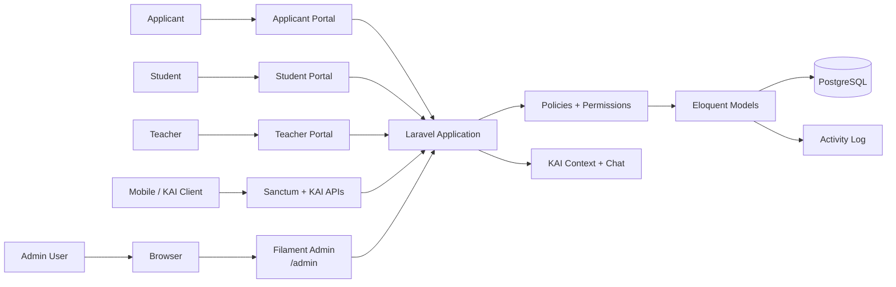
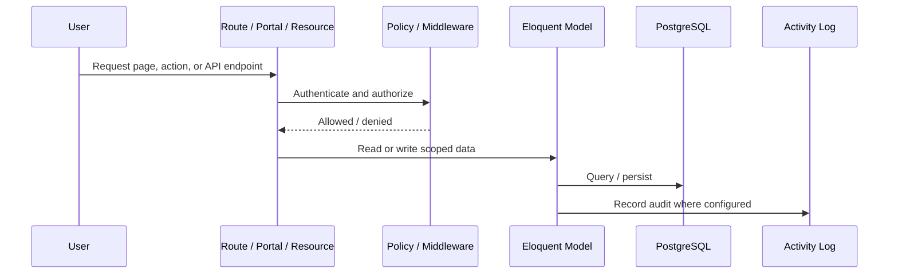
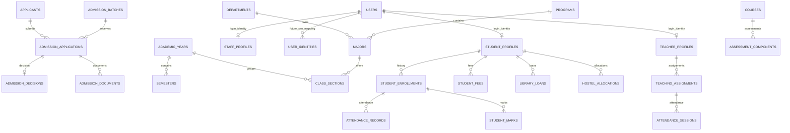

# Kyauksetu ERP


Kyauksetu ERP is a Laravel university ERP and KAI backend MVP. The current system combines a Filament admin panel, applicant/student/teacher web portals, Sanctum mobile authentication, announcement-backed mobile notifications, and KAI context/chat APIs over a modular ERP data foundation.

The project is currently **demo-ready MVP stage** with a verified backend API for the `kai-flutter` MVP integration. Seeded demo data supports the core admin, applicant, student, teacher, mobile API, and KAI journeys described in [docs/DEMO_FLOW.md](docs/DEMO_FLOW.md). The mobile API contract is available in [docs/MOBILE_API_CONTRACT.md](docs/MOBILE_API_CONTRACT.md), and a concise MVP review is available in [docs/MVP_REVIEW.md](docs/MVP_REVIEW.md).

## Table of Contents

- [Current Stage](#current-stage)
- [Application Surfaces](#application-surfaces)
- [Tech Stack](#tech-stack)
- [Completed MVP Features](#completed-mvp-features)
- [Demo Flow](#demo-flow)
- [Architecture](#architecture)
- [Domain Model](#domain-model)
- [Security and Audit](#security-and-audit)
- [Known Limitations](#known-limitations)
- [Production Readiness Gap](#production-readiness-gap)
- [Local Development](#local-development)
- [Verification](#verification)
- [Project Structure](#project-structure)
- [Development Notes](#development-notes)

## Current Stage

| Area | Status | Notes |
| --- | --- | --- |
| ERP admin foundation | Implemented | Filament admin resources for ERP foundation and demo operations |
| IAM / roles / permissions | Implemented | Spatie Permission roles, permissions, and policies |
| Audit logging | Implemented | Spatie Activitylog on important managed records |
| Academic structure | Implemented | Departments, years, semesters, programs, majors, sections, courses |
| Admissions | Implemented | Batches, applicants, applications, decisions, conversion path |
| Applicant portal | Implemented | Login, dashboard, applications, application detail/status |
| Student portal | Implemented | Profile, enrollment, timetable, attendance, results, fees, library, hostel, announcements |
| Teacher portal | Implemented | Profile, assignments, timetable, classes, announcements, attendance, marks |
| Teacher attendance workflow | Implemented | Own-assignment attendance sessions and records |
| Teacher marks workflow | Implemented | Own-assignment assessment components and student marks |
| Mobile auth API | Verified ready | Sanctum bearer-token login for supported student/teacher accounts with `mobile` token ability |
| Mobile student data API | Verified ready | Student profile, enrollment, timetable, attendance, results, fees, library, hostel, and announcements |
| Mobile notifications API | Implemented | Announcement-backed `/api/v1/notifications` feed for supported mobile roles |
| KAI context/chat API | Verified ready | Scoped student/teacher context and local chat responder by default |
| Laravel AI SDK foundation | Implemented | External provider config foundation and smoke command |
| KAI logging/admin review | Implemented | Chat sessions/messages available for admin review |
| Demo data and flow | Implemented | Demo accounts and seeded story in `docs/DEMO_FLOW.md` |
| Flutter app | Not implemented here | Laravel backend is ready for the `kai-flutter` MVP API integration |
| Push notifications | Not implemented | Current mobile notifications are API feed items, not FCM/APNs push delivery |
| SSO | Not implemented | Identity mapping foundation exists, login behavior is not enabled |

## Application Surfaces

| Surface | Path / Endpoint | Purpose |
| --- | --- | --- |
| Filament Admin | `/admin` | ERP administration, review, and operational records |
| Applicant Portal | `/applicant/login` | Applicant login and admission application status |
| Student Portal | `/student/login` | Student profile, academic activity, fees, library, hostel, announcements |
| Teacher Portal | `/teacher/login` | Teacher assignments, classes, attendance, marks, announcements |
| Mobile Auth API | `/api/v1/auth/login` | Sanctum token login for mobile/KAI clients |
| Mobile Student API | `/api/v1/my-profile` | Student profile and paginated student data endpoints |
| Mobile Notifications API | `/api/v1/notifications` | Announcement-backed notification feed |
| KAI Context API | `/api/v1/kai/context` | Permission-safe student/teacher context |
| KAI Chat API | `/api/v1/kai/chat` | Local KAI responder by default, external AI opt-in |

## Tech Stack

| Layer | Technology |
| --- | --- |
| Runtime | PHP 8.5 |
| Framework | Laravel 13 |
| Admin UI | Filament 5 |
| Reactive layer | Livewire 4 |
| Database | PostgreSQL |
| Web auth | Laravel session auth |
| API auth | Laravel Sanctum |
| Authorization | Spatie Laravel Permission |
| Audit logs | Spatie Laravel Activitylog |
| AI foundation | Laravel AI SDK |
| Dev environment | Laravel Sail, Docker |
| Frontend tooling | Vite, Tailwind CSS |
| Testing | PHPUnit 12 |
| Code style | Laravel Pint |
| Laravel assistance | Laravel Boost |

## Completed MVP Features

### ERP Admin Foundation

- Filament admin panel for managing and reviewing ERP data.
- Modular admin resource groups for identity, people/profiles, academic structure, SIS, admissions, attendance, exams/results, communication, library, hostel, finance, inventory, HR, and KAI review records.
- Demo branding and seeded data for presentation use.

### IAM, Permissions, and Audit

- `User` represents login identity.
- Roles and permissions are managed with Spatie Permission.
- Policies protect admin resources and portal workflows.
- Important managed models use Spatie Activitylog.
- `user_identities` provides a foundation for future SSO mapping.

Current roles include:

- `super_admin`
- `registrar`
- `department_admin`
- `teacher`
- `student`
- `librarian`
- `hostel_warden`
- `finance_officer`

### Admissions and Applicant Portal

- Admission batches, applicants, applications, decisions, and supporting records.
- Applicant login, dashboard, applications list, application detail, and status view.
- Accepted applicant-to-student conversion path through admin workflow.

### Student Portal

- Student dashboard and profile.
- Enrollment and academic placement.
- Timetable, attendance, results, fees, library loans, hostel allocation, and announcements.
- Demo story links the accepted admission to an active student profile with populated academic/support records.

### Teacher Portal

- Teacher dashboard and profile.
- Assignments, timetable, classes, and announcements.
- Attendance workflow scoped to the teacher's assigned classes.
- Marks workflow scoped to the teacher's assigned assessment components and enrolled students.

### Mobile and KAI APIs

- Sanctum mobile login for student and teacher users with mobile-scoped token ability.
- Protected API routes require a Sanctum token with the `mobile` ability.
- Student-only API routes enforce student role/profile boundaries.
- Student list endpoints return paginated API resources with `page`, `per_page`, `from`, and `to` query support.
- Mobile notifications endpoint exposes visible announcements in a stable feed shape.
- KAI context endpoint for permission-safe student/teacher context.
- KAI chat endpoint using the local responder by default.
- External AI provider configuration foundation through Laravel AI SDK.
- KAI smoke command for checking local/external responder configuration.
- KAI chat logging for admin review.
- Full request/response details for Flutter integration live in [docs/MOBILE_API_CONTRACT.md](docs/MOBILE_API_CONTRACT.md).

## Demo Flow

Use [docs/DEMO_FLOW.md](docs/DEMO_FLOW.md) as the source of truth for the demo journey.

Demo accounts use:

```text
DemoPass123!
```

| Role | Email | Journey |
| --- | --- | --- |
| Super admin | `demo.admin@kyauksetu.test` | Admin review across ERP modules |
| Admission officer | `demo.admissions@kyauksetu.test` | Admissions/admin review using registrar role |
| Applicant | `demo.applicant@kyauksetu.test` | Applicant dashboard and accepted application |
| Student | `demo.student@kyauksetu.test` | Student portal and KAI mobile/API context |
| Teacher | `demo.teacher@kyauksetu.test` | Teacher portal, attendance, and marks |

Seed demo data in a non-production environment only:

```bash
vendor/bin/sail artisan db:seed --class=DemoDataSeeder
```

## Architecture



### Request and Authorization Flow



## Domain Model



## Security and Audit

- Admin resources are protected through Filament, Laravel policies, and role/permission checks.
- Portal routes are scoped to the authenticated applicant, student, or teacher.
- Mobile API routes require Sanctum bearer tokens with the `mobile` ability.
- Mobile role middleware restricts student-only and student/teacher endpoints.
- Teacher attendance and marks workflows enforce own-assignment / own-class access.
- Tests cover important cross-user protection paths.
- KAI context is assembled from permission-safe user context.
- KAI does not receive unrestricted SQL or database access.
- External AI calls are opt-in; local deterministic responder is the default.
- KAI logs are available for admin review while avoiding secrets and unrestricted raw context exposure.

## Known Limitations

- No Flutter app yet.
- External AI is not enabled by default.
- No push notification delivery yet; mobile notifications currently use the API feed.
- No file upload workflow yet.
- No payment gateway.
- No SSO login behavior yet.
- No advanced reports/PDFs yet.
- No full production deployment hardening yet.

## Production Readiness Gap

Before production rollout, the project still needs:

- Production deployment target and deploy process.
- Database backup and restore plan.
- Monitoring, centralized logging, and alerting.
- Production environment/secret management.
- Queue worker and scheduler supervision where async work is introduced.
- File storage strategy for uploaded/private documents.
- Rate limiting review for auth, KAI, and high-risk endpoints.
- Real data migration planning and reconciliation.
- Stakeholder review of the final permission matrix.

## Local Development

This project is configured to run through Laravel Sail.

### Start services

```bash
vendor/bin/sail up -d
```

### Install dependencies

```bash
vendor/bin/sail composer install
vendor/bin/sail npm install
```

### Configure environment

```bash
cp .env.example .env
vendor/bin/sail artisan key:generate
```

Update database values in `.env` if needed. The active project environment is Sail/PostgreSQL-oriented. For Android emulator testing, use `http://10.0.2.2/api/v1` as the Flutter base URL when Sail exposes the app on port 80.

### Run migrations and core seeders

```bash
vendor/bin/sail artisan migrate
vendor/bin/sail artisan db:seed --class=IamRolePermissionSeeder
```

### Seed demo data

Use only in non-production environments:

```bash
vendor/bin/sail artisan db:seed --class=DemoDataSeeder
```

### Build frontend assets

```bash
vendor/bin/sail npm run build
```

For local asset development:

```bash
vendor/bin/sail npm run dev
```

## Verification

Run the compact test suite:

```bash
vendor/bin/sail artisan test --compact
```

Format PHP code:

```bash
vendor/bin/sail bin pint --dirty --format agent
```

Check KAI responder configuration:

```bash
vendor/bin/sail artisan kai:smoke
```

Check mobile API routes:

```bash
vendor/bin/sail artisan route:list --path=api --except-vendor
```

The current verified readiness baseline is 77 passing tests, 391 assertions, 16 `/api/v1` routes, and successful manual curl checks for login, authenticated profile data, announcements, notifications, KAI chat, invalid-token rejection, and student-only role blocking.

Audit Composer dependencies:

```bash
vendor/bin/sail composer audit
```

## Project Structure

```text
app/
  Console/Commands/      KAI smoke and project commands
  Filament/
    Resources/           Admin CRUD and review resources
    Widgets/             Admin dashboard widgets
  Http/
    Controllers/         Portal and API controllers
    Middleware/          Applicant/student/teacher guards
    Requests/            Form request validation
    Resources/           API response resources
  Models/                Eloquent domain models
  Policies/              Authorization policies
  Services/Kai/          KAI context, responder, prompt, and logging services
database/
  migrations/            Database schema history
  seeders/               IAM, smoke, and demo seeders
docs/
  DEMO_FLOW.md           Demo journey source of truth
  MOBILE_API_CONTRACT.md Flutter/mobile API contract
  MVP_REVIEW.md          Current MVP review
routes/
  api.php                Mobile and KAI API routes
  web.php                Web portal routes
```

## Development Notes

- Use Laravel, Filament, and Laravel Boost conventions.
- Run project commands through Sail.
- Prefer Artisan generators for new Laravel and Filament classes.
- Keep user identity, institutional profiles, and academic history separate.
- Add permissions and policies with each new admin-managed domain model.
- Keep KAI context permission-safe and role-scoped.
- Keep migrations forward-only once they have run in shared environments.
