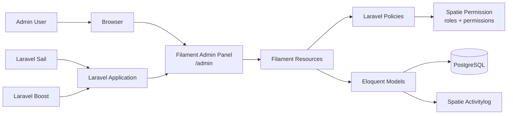
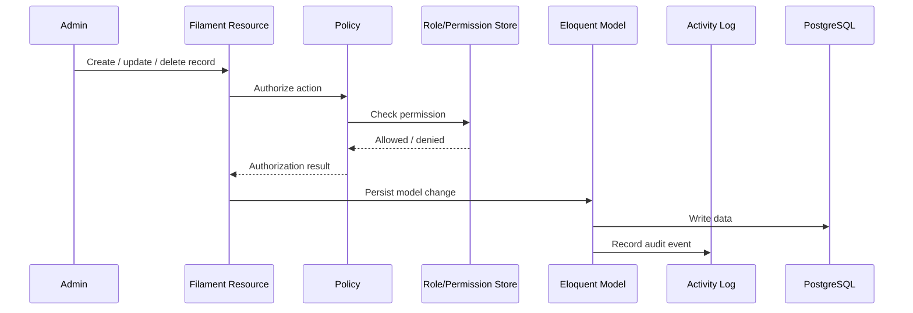
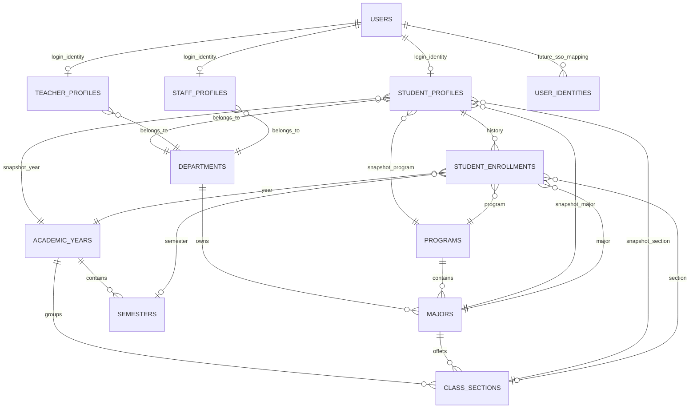

# Kyauksetu ERP


Kyauksetu ERP is a Laravel and Filament based university ERP foundation. The current implementation focuses on identity and access management, academic master data, profile records, and the first SIS enrollment history layer.

The system is intentionally modular. Login identity is kept separate from student, teacher, and staff profiles, and student enrollment history is tracked separately from the current student profile snapshot.

## Table of Contents

- [Status](#status)
- [Tech Stack](#tech-stack)
- [Implemented Foundations](#implemented-foundations)
- [Architecture](#architecture)
- [Domain Model](#domain-model)
- [Admin Panel](#admin-panel)
- [Local Development](#local-development)
- [Verification](#verification)
- [Project Structure](#project-structure)
- [Security and Audit](#security-and-audit)
- [Current Boundaries](#current-boundaries)

## Status

| Area | Status | Notes |
| --- | --- | --- |
| IAM foundation | Implemented | Users, roles, permissions, future SSO identity mapping |
| Audit logging | Implemented | Spatie Activitylog on important IAM, academic, profile, and SIS models |
| Academic structure | Implemented | Departments, academic years, semesters, programs, majors, class sections |
| Profiles | Implemented | Student, teacher, and staff profile foundations |
| Student enrollment | Implemented | Historical student enrollment records |
| Attendance | Not implemented | Out of current scope |
| Grades and results | Not implemented | Out of current scope |
| Timetable | Not implemented | Out of current scope |
| Student portal | Not implemented | Out of current scope |
| KAI integration | Not implemented | Out of current scope |
| SSO and mobile auth | Not implemented | Tables are SSO-ready, behavior is not implemented |

## Tech Stack

| Layer | Technology |
| --- | --- |
| Runtime | PHP 8.5 |
| Framework | Laravel 13 |
| Admin UI | Filament 5 |
| Reactive layer | Livewire 4 |
| Database | PostgreSQL |
| Auth | Laravel session auth |
| Authorization | Spatie Laravel Permission |
| Audit logs | Spatie Laravel Activitylog |
| Dev environment | Laravel Sail, Docker |
| Frontend tooling | Vite, Tailwind CSS |
| Testing | PHPUnit 12 |
| Code style | Laravel Pint |
| Laravel assistance | Laravel Boost |

## Implemented Foundations

### IAM

- `User` represents login identity only.
- Roles and permissions are provided by `spatie/laravel-permission`.
- Current roles:
  - `super_admin`
  - `registrar`
  - `department_admin`
  - `teacher`
  - `student`
  - `librarian`
  - `hostel_warden`
  - `finance_officer`
- `user_identities` exists for future SSO provider mapping.

### Academic Structure

- Departments
- Academic years
- Semesters
- Programs
- Majors
- Class sections

### Profiles

- Student profiles store SIS-ready person and academic snapshot data.
- Teacher profiles store teaching staff profile data.
- Staff profiles store non-teaching staff profile data.
- Profile records are separate from `users`.

### SIS Enrollment

- `StudentEnrollment` stores historical academic enrollment.
- Student profile academic fields can remain as a current snapshot.
- Enrollment history is tracked separately by academic year, semester, program, major, class section, year level, and status.

## Architecture



### Request and Authorization Flow



## Domain Model



## Admin Panel

The ERP administration panel is available at:

```text
/admin
```

Current Filament resource groups include:

| Group | Resources |
| --- | --- |
| IAM | Users |
| Organization | Departments |
| Academic Structure | Academic Years, Semesters, Programs, Majors, Class Sections |
| Profiles | Student Profiles, Teacher Profiles, Staff Profiles |
| SIS | Student Enrollments |

## Local Development

This project is configured to run through Laravel Sail.

### Start services

```bash
vendor/bin/sail up -d
```

### Install dependencies

```bash
vendor/bin/sail composer install
vendor/bin/sail npm install
```

### Configure environment

```bash
cp .env.example .env
vendor/bin/sail artisan key:generate
```

Update database values in `.env` if needed. The active project environment is PostgreSQL-oriented.

### Run migrations and seeders

```bash
vendor/bin/sail artisan migrate
vendor/bin/sail artisan db:seed --class=IamRolePermissionSeeder
```

### Build frontend assets

```bash
vendor/bin/sail npm run build
```

For local asset development:

```bash
vendor/bin/sail npm run dev
```

## Verification

Run the compact test suite:

```bash
vendor/bin/sail artisan test --compact
```

Format PHP code:

```bash
vendor/bin/sail bin pint --dirty --format agent
```

Check admin routes:

```bash
vendor/bin/sail artisan route:list --path=admin --except-vendor
```

Audit Composer dependencies:

```bash
vendor/bin/sail composer audit
```

## Project Structure

```text
app/
  Filament/
    Resources/          Admin CRUD resources
  Models/               Eloquent domain models
  Policies/             Authorization policies
database/
  migrations/           Database schema history
  seeders/              Role and permission seeders
config/
  permission.php        Spatie permission configuration
  activitylog.php       Spatie activitylog configuration
routes/
  web.php               Web route entrypoint
```

## Security and Audit

- All admin resources are protected through Filament and Laravel policies.
- Permissions are seeded centrally through `IamRolePermissionSeeder`.
- `super_admin` receives all seeded permissions.
- Important IAM, academic, profile, and SIS models use Spatie Activitylog.
- `User` is intentionally kept as login identity only.
- `UserIdentity` exists for future provider mapping, but SSO behavior is not implemented.

## Current Boundaries

The codebase currently provides ERP/SIS foundations only. The following are intentionally not implemented yet:

- Attendance
- Grades and result management
- Timetable
- Enrollment workflows beyond historical enrollment records
- Finance
- Student portal
- KAI integration
- Sanctum mobile authentication
- SSO login behavior

## Development Notes

- Use Laravel, Filament, and Laravel Boost conventions.
- Prefer Artisan generators for new Laravel and Filament classes.
- Run commands through Sail.
- Keep user identity, institutional profiles, and academic history separate.
- Add permissions and policies with each new admin-managed domain model.
- Keep migrations forward-only once they have run in shared environments.
